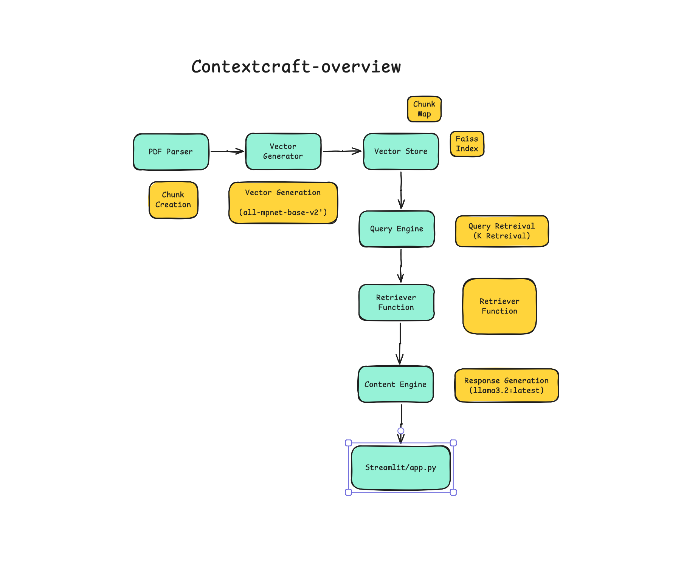

# ContextCraft: A Retrieval-Augmented Generation Framework



## 📚 Project Overview

**ContextCraft** is a Retrieval-Augmented Generation (RAG) framework designed for intelligent query answering and document analysis. It integrates various components like PDF parsing, vector generation, FAISS indexing, and response generation to create an efficient pipeline for extracting insights from large documents.

### 🛠️ Key Features

- **PDF Parsing and Chunking**: Breaks down documents into manageable chunks for processing.
- **Vector Store Integration**: Uses FAISS for efficient similarity search and indexing.
- **State-of-the-Art Models**: Leverages `all-mpnet-base-v2` for vector generation and `llama3.2:latest` for generating intelligent responses.
- **Streamlit UI**: Provides an interactive web application for user-friendly query answering.

---

## ⚙️ Workflow

The ContextCraft pipeline follows the stages depicted in the diagram:

1. **PDF Parsing and Chunk Creation**:
   - Input PDF files are parsed and split into smaller chunks for efficient processing.
2. **Vector Generation**:
   - Uses the `all-mpnet-base-v2` model to generate embeddings for each document chunk.
3. **Vector Store**:
   - Embeddings are stored in a FAISS index for fast similarity searches.
4. **Query Engine**:
   - Facilitates retrieval of the most relevant chunks using k-retrieval.
5. **Retriever and Content Engine**:
   - Aggregates retrieved chunks and prepares context for generating responses.
6. **Response Generation**:
   - Powered by `llama3.2:latest`, the system generates natural language answers based on the retrieved context.
7. **Streamlit Application**:
   - A user-friendly web interface built with Streamlit (`app.py`) for real-time interaction.

---

## 🚀 Installation

### Prerequisites

- Python >= 3.11
- Virtual environment (venv)
- Jupyter Notebook or JupyterLab
- Streamlit for running the web app

### Steps

1. Clone the repository:

   ```bash
   git clone https://github.com/udit-rawat/ContextCraft.git
   cd ContextCraft
   ```

2. Create and activate a virtual environment:

   - **On macOS/Linux**:
     ```bash
     python3 -m venv venv
     source venv/bin/activate
     ```
   - **On Windows**:
     ```bash
     python -m venv venv
     .\venv\Scripts\activate
     ```

3. Install dependencies from `requirements.txt`:

   ```bash
   pip install -r requirements.txt
   ```

4. Unzip your PDF file(s):

   - Place your PDF files in the appropriate folder within the project directory.

5. Run the Jupyter Notebooks:
   - Launch Jupyter Notebook from the command line:
     ```bash
     jupyter notebook
     ```
   - Open and run the following notebooks sequentially in the browser:
     1. **`parser.ipynb`**: This notebook will parse your PDF file(s) and create chunks.
     2. **`query_engine.ipynb`**: This notebook sets up the query engine for retrieving relevant document chunks.
     3. **`vector_generator.ipynb`**: Generates vector embeddings for the chunks using the `all-mpnet-base-v2` model.
     4. **`vector_store.ipynb`**: Stores the generated vectors in a FAISS index for fast retrieval.

---

## 🔧 Configuration

### Modify Paths

- Ensure that your PDF files are unzipped and placed in the correct directory as specified in the notebooks.
- Adjust FAISS index parameters if working with large datasets.

---

## 🌟 Key Technologies Used

- **FAISS**: Efficient similarity search and clustering of dense vectors.
- **Sentence Transformers**: `all-mpnet-base-v2` for embedding generation.
- **Llama Model**: `llama3.2:latest` for response generation.
- **Streamlit**: Fast and customizable web-based interface.

---

## 📂 Directory Structure

```
ContextCraft/
├── app.py               # Main Streamlit application
├── core/                # Core functionality (parsing, embedding, etc.)
├── data/                # Placeholder for input PDFs
├── faiss_store/         # Prebuilt FAISS indexes
├── notebooks/           # Folder for Jupyter Notebooks
│   ├── parser.ipynb     # Notebook for PDF parsing and chunk creation
│   ├── query_engine.ipynb # Notebook for setting up query engine
│   ├── vector_generator.ipynb # Notebook for generating vectors
│   └── vector_store.ipynb # Notebook for storing vectors in FAISS
└── README.md            # Documentation
```

---

## 📊 Example Use Case

1. Upload and unzip your PDF document in the `data/` directory.
2. Open and run the following notebooks in order:
   - **`parser.ipynb`**: Parse the PDF and generate document chunks.
   - **`query_engine.ipynb`**: Set up the query engine.
   - **`vector_generator.ipynb`**: Generate vector embeddings for the document chunks.
   - **`vector_store.ipynb`**: Store the embeddings in a FAISS index.
3. The system will process the PDF, generate embeddings, store them in FAISS, and allow for efficient query answering.

---

## 🖼️ Diagram Reference

The architecture diagram is shown above, outlining the flow from PDF parsing to response generation.

---

## 🤝 Contributing

1. Fork the repository.
2. Create a new branch:
   ```bash
   git checkout -b feature-name
   ```
3. Commit your changes and create a pull request.

---

## 📜 License

This project is licensed under the MIT License.

---

Let me know if you need further modifications!
